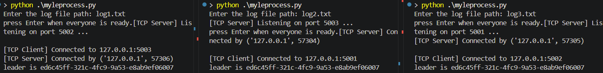
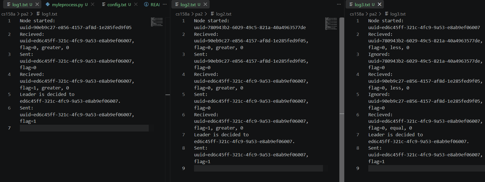

# How to run:

Make sure you are in the directory with `config.txt`.

## For local demo:

Run `python .\myleprovcess` in a terminal window to start the first process, and enter a path for a log file (e.g. `log1.txt`).

Update `config.txt` such that the second entry port is an unused port, and the first entry port is the previous second entry port.

Run `python .\myleprovcess` in a new terminal window to start a second process, and enter another path for a log file (e.g. `log2.txt`).

Repeat the previous 2 steps for as many processes as needed. For the final process, use the first entry port of the first process instead of an unused port for the new second entry port.

Press Enter on each of the processes to connect each to the next as a client and start execution of the leader election.

## For in-class demo:

Update `config.txt` such that the first entry includes your IP address, and the second entry is the info exchanged with another student.

Run `python .\myleprovcess` in a terminal window and enter a path for a log file.

Wait for everyone in class to have their servers set up, then press Enter to connect to next node as a client.

## Execution example:

# AI usage:

VSCode autocomplete used for the following functions:

`to_json(self) -> str`

`from_json(json_str: str) -> 'Message'`

`read_config()`

`log(log_path, message: str) -> None`
